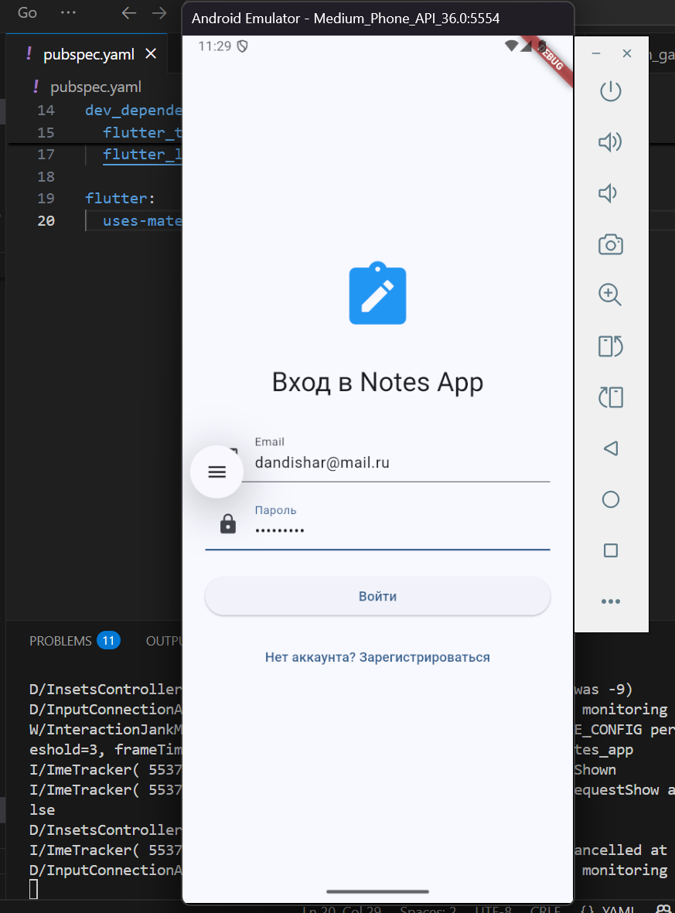
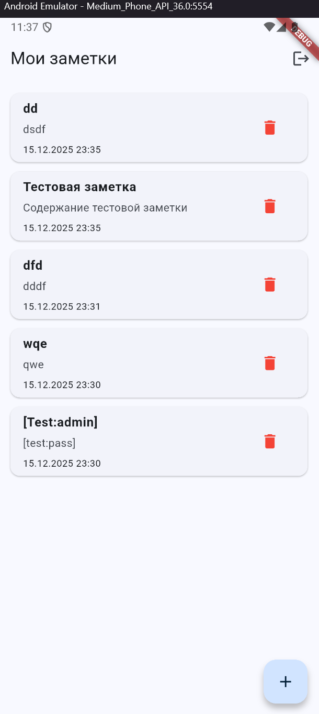

# Supabase Notes App

## Описание
Приложение для управления заметками с использованием Flutter и Supabase.

## Установка
1. Клонируйте репозиторий
2. Установите зависимости: `flutter pub get`
3. Создайте файл `.env` с ключами
4. Запустите: `flutter run`

## Настройка Supabase
1. Создайте проект в Supabase
2. Создайте таблицу `notes`
3. Включите RLS
4. Создайте политики доступа

## Зависимости
- supabase_flutter: ^2.1.3
- flutter_dotenv: ^5.1.0

## Архитектура
- main.dart: инициализация приложения
- auth_gate.dart: экран аутентификации
- notes_page.dart: управление заметками

## Безопасность
- RLS политики для изоляции данных пользователей
- Хранение ключей в .env файле
- Валидация на стороне клиента

## Решенные проблемы
1. Ошибка "Permission denied" - исправлено настройкой RLS
2. Реалтайм не обновлялся - добавлен primaryKey в stream()
3. Утечки памяти - добавлена проверка mounted

# Скрины

